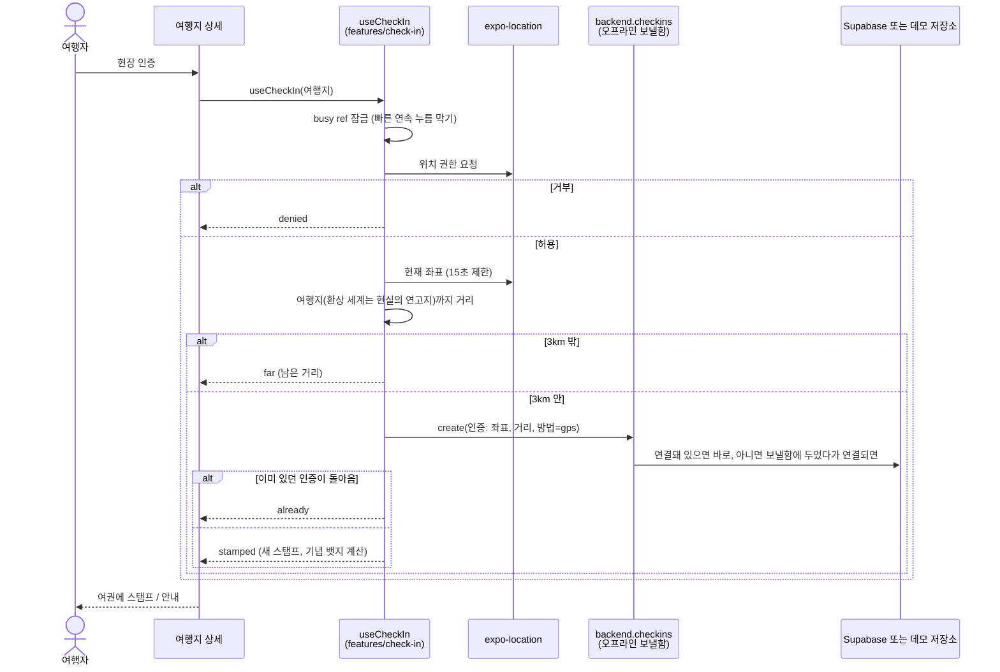
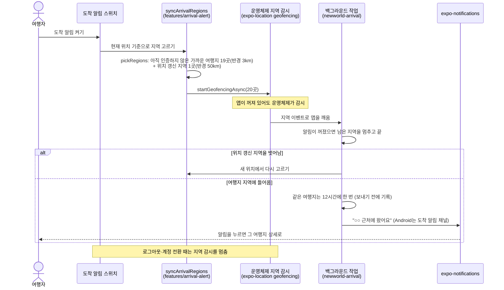

# 시퀀스 다이어그램

NewWorld의 주요 흐름입니다. 데이터는 `shared/api`의 `backend`를 거치며, Supabase 설정이 있으면 서버, 없으면 데모 저장소에 쓰고, 그 앞에 오프라인 보낼함이 있습니다.

## 1. 현장 인증 스탬프

```mermaid
sequenceDiagram
    actor 여행자
    participant 상세 as 여행지 상세
    participant 인증 as useCheckIn<br/>(features/check-in)
    participant 위치 as expo-location
    participant 백엔드 as backend.checkins<br/>(오프라인 보낼함)
    participant 저장 as Supabase 또는 데모 저장소

    여행자->>상세: 현장 인증
    상세->>인증: useCheckIn(여행지)
    인증->>인증: busy ref 잠금 (빠른 연속 누름 막기)
    인증->>위치: 위치 권한 요청
    alt 거부
        인증-->>상세: denied
    else 허용
        인증->>위치: 현재 좌표 (15초 제한)
        인증->>인증: 여행지(환상 세계는 현실의 연고지)까지 거리
        alt 3km 밖
            인증-->>상세: far (남은 거리)
        else 3km 안
            인증->>백엔드: create(인증: 좌표, 거리, 방법=gps)
            백엔드->>저장: 연결돼 있으면 바로, 아니면 보낼함에 두었다가 연결되면
            alt 이미 있던 인증이 돌아옴
                인증-->>상세: already
            else
                인증-->>상세: stamped (새 스탬프, 기념 뱃지 계산)
            end
        end
    end
    상세-->>여행자: 여권에 스탬프 / 안내
```

## 2. 근처 여행지 도착 알림

```mermaid
sequenceDiagram
    actor 여행자
    participant 설정 as 도착 알림 스위치
    participant 지역 as syncArrivalRegions<br/>(features/arrival-alert)
    participant OS as 운영체제 지역 감시<br/>(expo-location geofencing)
    participant 작업 as 백그라운드 작업<br/>(newworld-arrival)
    participant 알림 as expo-notifications

    여행자->>설정: 도착 알림 켜기
    설정->>지역: 현재 위치 기준으로 지역 고르기
    지역->>지역: pickRegions: 아직 인증하지 않은 가까운 여행지 19곳(반경 3km)<br/>+ 위치 갱신 지역 1곳(반경 50km)
    지역->>OS: startGeofencingAsync(20곳)
    Note over OS: 앱이 꺼져 있어도 운영체제가 감시
    OS->>작업: 지역 이벤트로 앱을 깨움
    작업->>작업: 알림이 꺼졌으면 남은 지역을 멈추고 끝
    alt 위치 갱신 지역을 벗어남
        작업->>지역: 새 위치에서 다시 고르기
    else 여행지 지역에 들어옴
        작업->>작업: 같은 여행지는 12시간에 한 번 (보내기 전에 기록)
        작업->>알림: "○○ 근처에 왔어요" (Android는 도착 알림 채널)
        알림-->>여행자: 알림을 누르면 그 여행지 상세로
    end
    Note over 설정,OS: 로그아웃·계정 전환 때는 지역 감시를 멈춤
```
